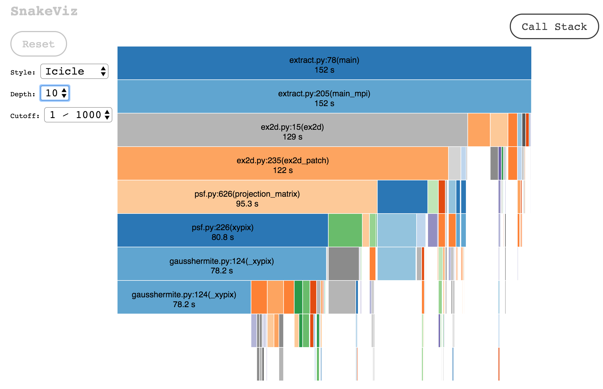
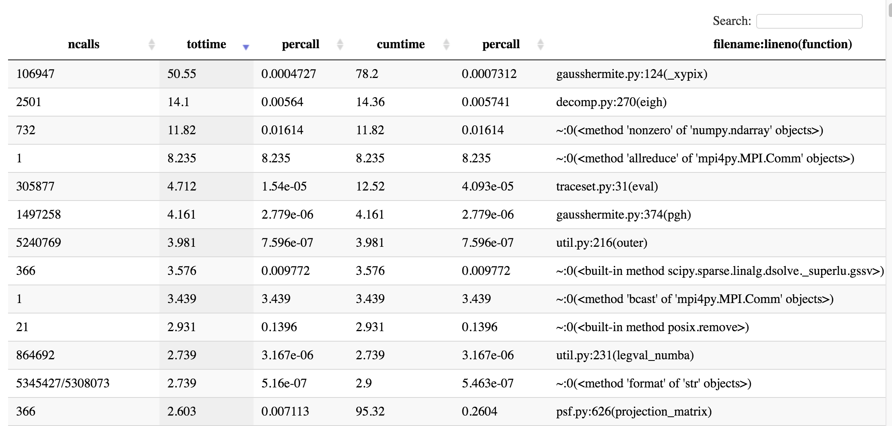
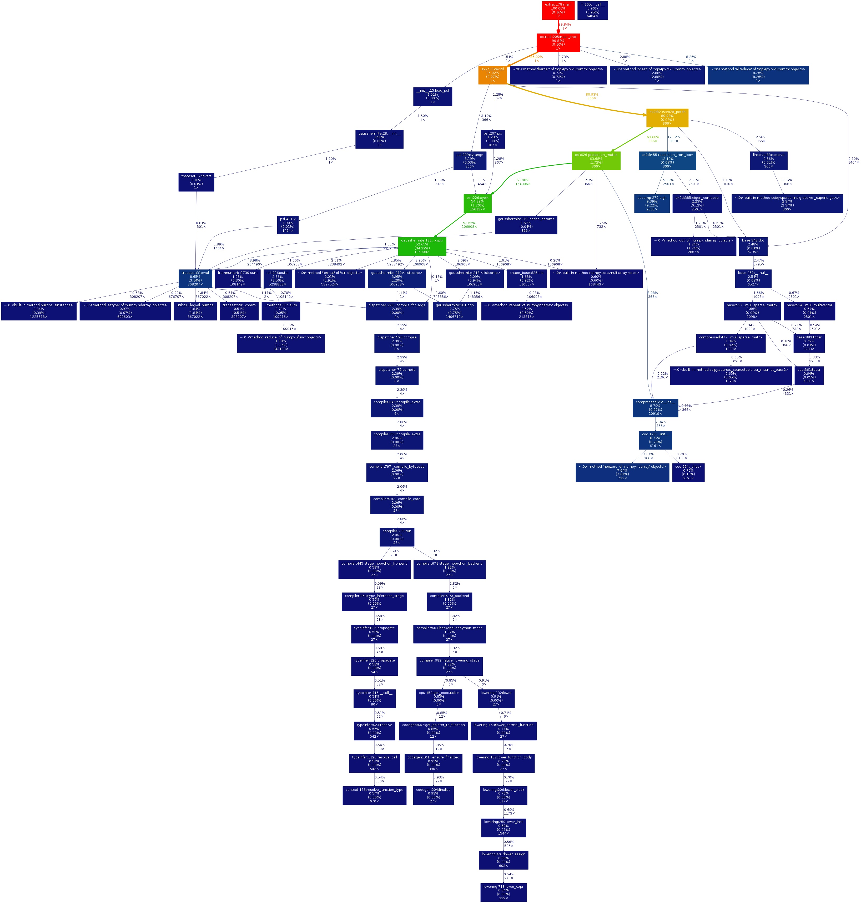
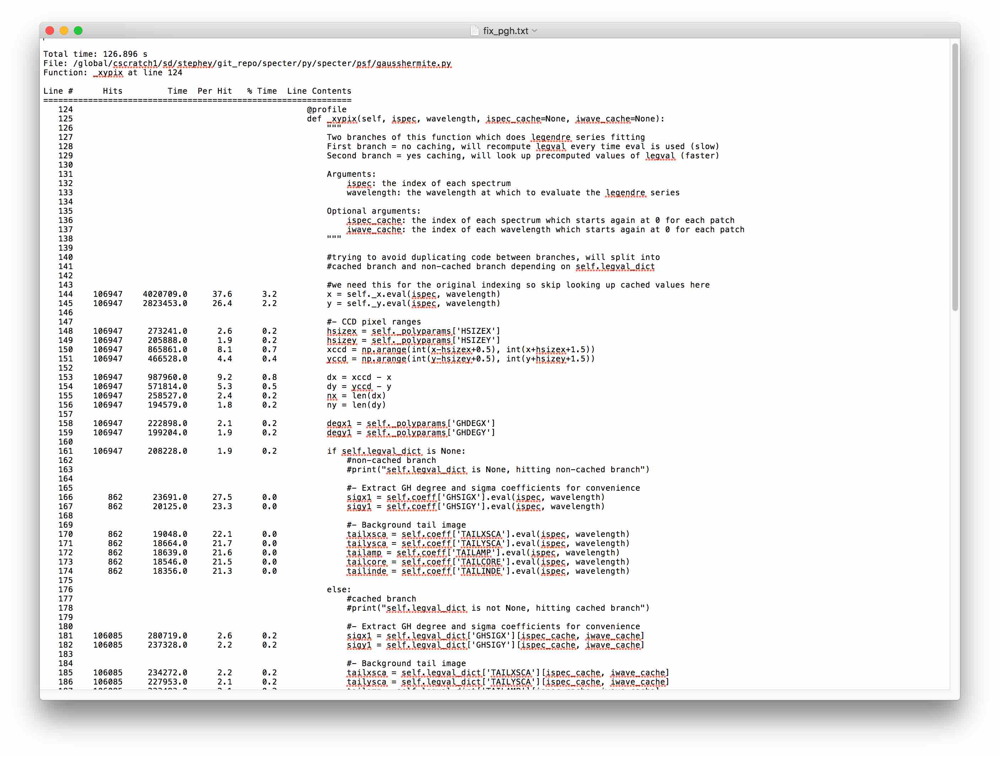
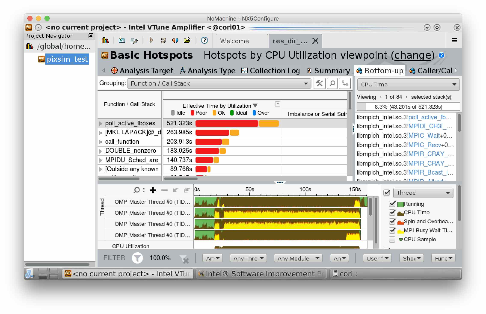
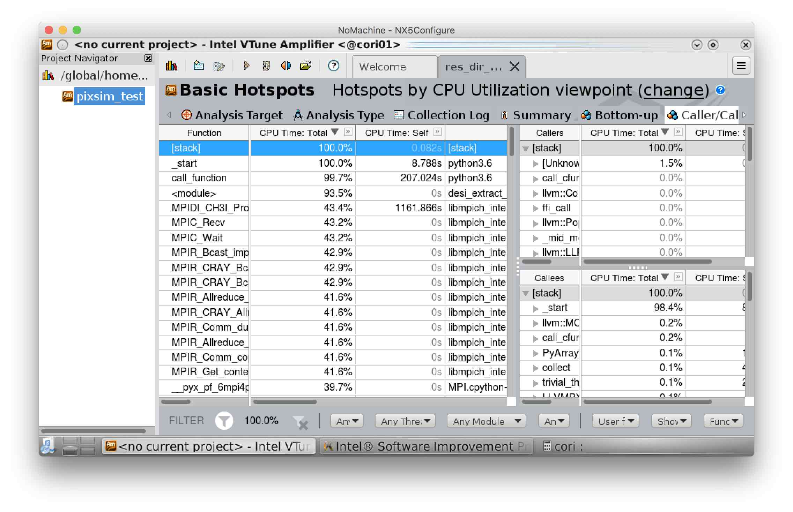
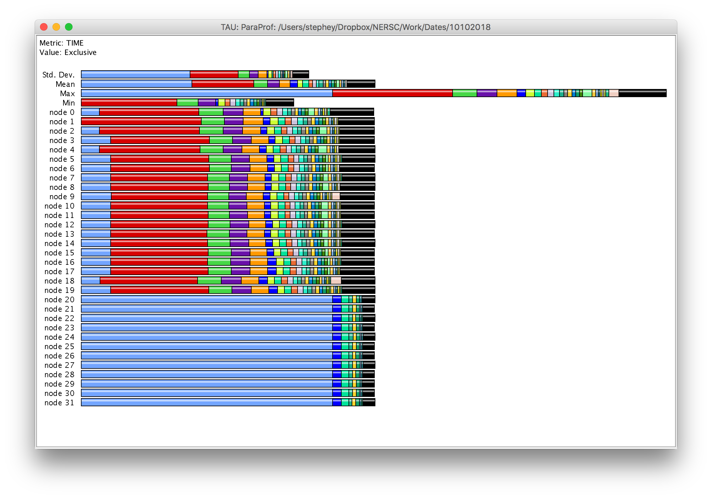
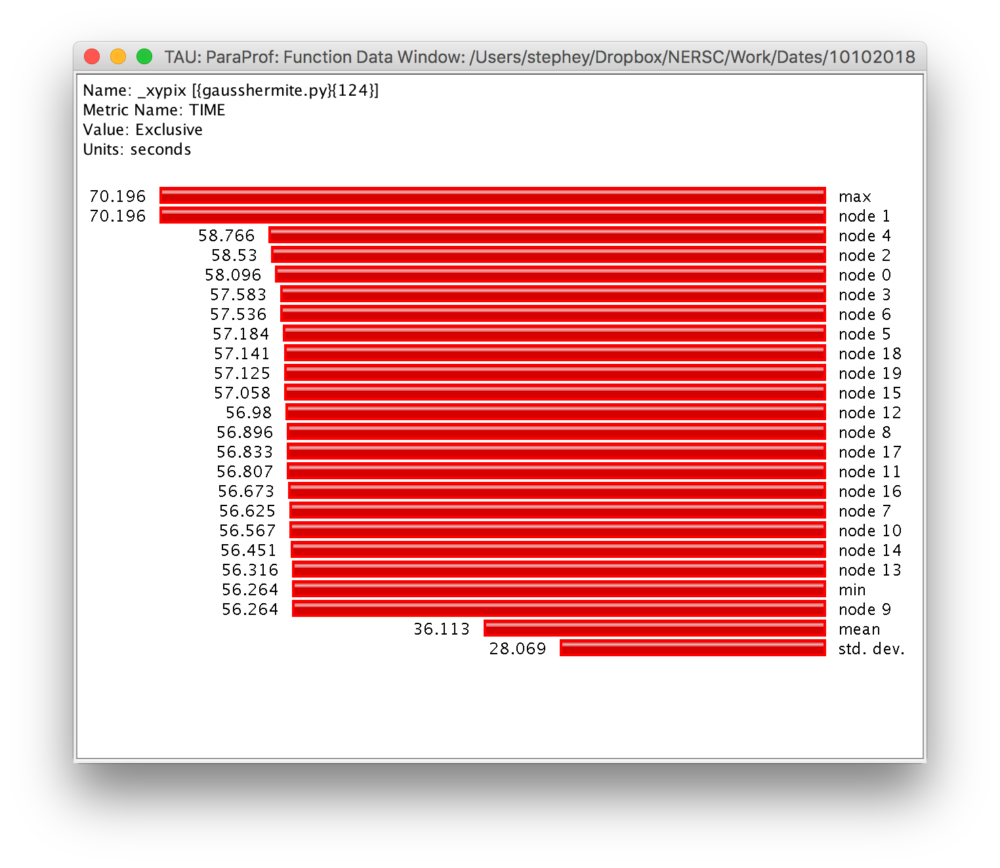
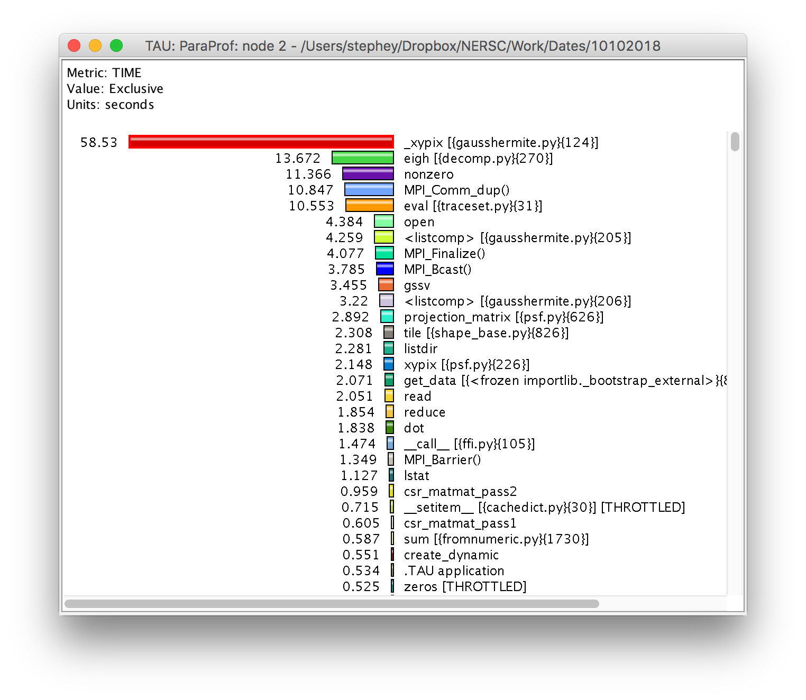

# Profiling Python

Here we will describe several tools and strategies for profiling Python code.
These are generally in order from simplest to most complex, and we recommend
that you also profile your application in a similar order. 

!!! tip "Keep it simple" 
    Often a simple tool
    can provide almost as much information as a complex tool with far less
    headache. 

##cProfile

Python has a nice, built-in statistical profiler called 
[cProfile](https://docs.python.org/3.2/library/profile.html).  You can
use it to collect data from your program without having to manually add any
instrumentation. You can then visualize the data you collected with several
tools. Two in particular, SnakeViz and gprof2dot, will be described in later
sections.

cProfile can be used to collect data for a single process or many processes
(for a Python code using mpi4py, for example.)

We will start with an example to profile a single process. In this example, we
will profile a Python application on Cori and transfer the results to our local
machine to visualize. This example will generate a .prof file which contains
the data we ultimately want. 

!!! tip "Don't forget"
    Make sure you have done `module load python` or otherwise sourced Python in
    your environment. Also make sure you have requested a compute node:
    `salloc -A your_repo -N 1 -t 60 -C haswell --qos=interactive`

Now you can run you application and collect data using cProfile:

`python -m cProfile -o output.prof path/to/your/script arg1 arg2`

Once your application is done running you can use scp or globus to transfer the
output.prof file to your local machine. 

Now let's examine a more complex case in which we profile several processes
from a Python program using mpi4py based on this 
[page](https://fbpic.github.io/advanced/profiling.html#profiling-mpi-simulations-cpu-side-only). 
We might want to do this to check that we
are adequately load-balancing among the MPI ranks, for example. This example
will write many `cpu_0.prof` files; one for each mpi rank. To avoid making a
mess we recommend creating a new directory for your results and cd into this
directory before running your application. This will also write some
human-readable `cpu_0.txt` files (which are nice as a sanity-check but
ultimately not as useful).

You will need to modify the beginning of your script by adding:

    import cProfile, sys
    from mpi4py.MPI import COMM_WORLD

You will also need to surround the part of your script that calls the main 
function with:

    pr = cProfile.Profile()
    pr.enable()
    YOUR MAIN FUNCTION
    pr.disable()

And then at the end of your program, you should add:

    # Dump results:
    # - for binary dump
    pr.dump_stats('cpu_%d.prof' %comm.rank)
    # - for text dump
    with open( 'cpu_%d.txt' %comm.rank, 'w') as output_file:
        sys.stdout = output_file
        pr.print_stats( sort='time' )
        sys.stdout = sys.__stdout__

Now you can run your script as you would normally (i.e. no cProfile command is
required):

`python /path/to/your/script arg1 arg2`

This modification will make your appliation write results to both a .prof file
and a .txt file for each mpi rank. Then you can use scp or globus to transfer
the output files to your local machine for further analysis.

## SnakeViz

Now that we have created a .prof file (or files) it's time to visualize the
data.  One browser-based option for this is [SnakeViz](https://jiffyclub.github.io/snakeviz/).

You can install SnakeViz using pip:

`pip install snakeviz`

Then in a command line, navigate to the directory where your .prof file is 
located, and type:

`snakeviz output.prof`

This should open an interactive window in your default broswer that displays
the data in your .prof file. By default data are displayed in a sunburst plot:


The call-stack depth can be adjusted to show deeper functions. You can also
click on a particular function which will generate a new plot with the selected
function now at the center.

Data can also be displayed in an icicle plot:



SnakeViz also creates a table listing the most expensive functions in the 
call-stack in descending order:



## gprof2dot

Another option for visualizing data in a .prof file is 
[gprof2dot](https://github.com/jrfonseca/gprof2dot). gprof2dot
differs from SnakeViz in that it writes static image files (usually .png) which
are perhaps easier to view and share than their browswer-based cousins, but
they are also not interactive. 

gprof2dot displays the data in dot-graph format. Embedded in this graph is also
the call-stack information. With gprof2dot it is easier to visualize the
typical flow of your application than it is in SnakeViz.

To use gprof2dot, you must also have graphviz installed.

Debian/Ubuntu users:
`apt-get install python3 graphviz`

RedHat/Fedora users:
`yum install python3 graphviz`

Then you can install gprof2dot using pip install:

`pip install gprof2dot`

!!! tip "If you're on Cori"
    If you are installing these on Cori, rather than your own machine, don't
    forget to append `--user` to the end of your install commands.

Note that for gprof2dot to work correctly, you should have also run your
application with Python 3 instead of Python 2. (You could also run with both in
Python 2, but don't do othat, Python 2 support is going to expire in 2020!)
Note that you also need to either copy the gprof2dot.py file to the directory
in which you will run the command, or you will need to add it to your search
path through something like: 

`export PYTHONPATH=/path/to/where/pip/installed/gprof2dot:$PYTHONPATH`

To generate the gprof2dot dot files from cProfile .prof data:

`python3 gprof2dot.py -f pstats output.prof | dot -Tpng -o output.png`

For this to work you need to make sure you have done `module load python` or
somehow sourced Python in your environment.

A typical gprof2dot image created from the same .prof data used in the SnakeViz
section above is shown below.

 

If you have an MPI application and have created many .prof files, 
you can use shell script magic to gprof2dot your data in a single command. 
Navigate to the directory in which your .prof files are located and:

```
for i in `seq 0 67`; do python3 gprof2dot.py -f pstats cpu_$i.prof | dot -Tpng -o cpu_$i.png; done
```

!!! tip "How many files would you like?"
    In this example, we wrote 68 files, one for each KNL cpu. For Haswell you
    should change the number 67 to 31 (Haswell has 32 cpus per node), or to
    whatever number of files you would like to process.

## line_profiler

Once you have discovered where the expensive parts of your application are, it
is probably time for another tool called 
[line_profiler](https://github.com/rkern/line_profiler). This is a
particularly handly tool because it gives line-by-line performance information
for a selected function.

!!! tip "Don't get ahead of yourself"
    We reccomend not starting with line_profiler right away, however, because the
    user must decorate the functions for which he or she would like to profile to
    get information.  It is usually both slow and impractical to manunally decorate
    all functions of interest. It is better to know already which functions are
    the most expensive (like _xypix is in our examples above).

line_profiler can be installed with pip:
`pip install line_profiler`

Like with gprof2dot, you must either move the kernprof.py script to the
directly in which you will execute line_profiler, or you must add kernprof.py
to your PYTHONPATH:

`export PYTHONPATH=/path/to/where/pip/installed/kernprof.py`

Then you must manaully decorate the function you would like profiling
information for.  In our case we will decorate the function _xypix:

```
@profile
def _xypix(arg1,arg2,arg3)
   """
   DESI sample function
   """
   return result
```

Once you have decorated the functions for which you would like line-by-line
performance data, you can run kernprof:

`python kernprof.py -l script_to_profile.py`

This will write an output file with the name of your script, i.e.
`script_to_profile.lprof`

You'll need one more step before you get nice, human-readable output:

`python -m line_profiler script_to_profile.lprof > line_profiler_out.txt`

!!! tip "Blank files?"
    If you get a blank file as an output, it's most likely because you forgot
    to decorate any functions. 

Here is the line_profiler output for our expensive function _xypix:



<!---
If you would like to profile an MPI application, you can use a custom modified
version of kernprof.py called kernprof_mpi.py. (What to do with this?) Use this
just as you would kernprof.py. This will cause one .lprof file to be written
for each MPI rank with the author rank number appended to the end of the
filename (for example, script_to_profile.lprof10). Then using a bash loop
command we can process all the files:

```
for i in `seq 0 31`; do python -m line_profiler script_to_profile.lprof$i > line_out_$i.txt; done
```
-->

## Intel Vtune

[Intel Vtune](https://software.intel.com/en-us/vtune-amplifier-help-python-code-analysis) 
is best used after other types of profiling have been able to give
you some idea what your problem (or problems) are. For example, do you have
some lines of code that are slow for reasons you don't understand? Do you spend
a lot of time in MPI calls? Do you have a load-imbalance problem (i.e. one of
your MPI ranks is working much harder than the others)? If so it is likely time
to start using heftier tools like Vtune and Tau (desribed in the next section).

Vtune shines in that it can tell if you memory access problems are slowing
you down, where your MPI overhead is coming from, and if any MPI functions that
have an explicit (or implicit) barrier are causing unncessary waiting in your 
application. 


!!! attention "Vtune has limited Python support" 
    Unfortunately Vtune has limited functionality for Python applications: only three
    types of collection modes are currently supported:

    1. hotspots (general performance overview)
    2. memory-consumption (memory-specific information)
    3. locksandwaits (threading analysis)

To use Vtune on Cori, first
`module load vtune`

Note that Vtune can be split into two parts: collection mode and finalization
mode.  Cori Haswell nodes are fast enough so that usually there's no need to
separate these steps. However, Cori KNL nodes can be very slow during the
finalization step, so in some cases it may make sense to collect data on KNL
but finalize later on Haswell.

The example we will show is for Haswell. Is is broken into two steps, so for
KNL, just perform the collection on KNL but finalize on Haswell. In this example
our Python binary file is desi_extract_spectra. The Vtune flags we have chosen
to use are explained below.

To start collecting data with Vtune, request an interactive node, and try:
```
srun -n 32 -c 2 amplxe-cl -collect hotspots -r results_dir -trace-mpi -search-dir bin:= /global/cscratch1/sd/stephey/git_repo/desispec/bin/desi_extract_spectra -finalization-mode=none arg1 arg2 arg3
```

!!! tip "Vtune may complain but don't panic"
    You may see various warnings and complaints from Vtune but as long as it
    prints `amplxe: Collection started` you should most likely be collecting 
    data. 

Some further explanation for why we use these arguments:

1. -collect hotspots tells Vtune which of the 3 possible colleciton modes to
use 
2. -trace-mpi asks to collect MPI data. If you don't have an MPI
application, don't add this flag.
3. -r results_dir tells Vtune to write results to the specified directory 
(which doesn't have to exist). Note also that Vtune will append the 
Cori node number to the end of your directory, i.e. results_dir.nid00058.
4. -search-dir is important for Python
applications in particular because it instructs Vtune where to look for the
scripts or binary files you are using. If you don't specify search-dir and have
trouble getting call-stack information, this might be the issue.  
5. -finalization-mode=none instructs Vtune to skip the finalization step
(especially good for KNL)

Once you have collected your data, you can finalize:

`amplxe-cl -finalize -r <results_dir.nid00058>`

!!! tip "Save yourself some trouble and use NX" 
    At this point we reccomend logging on to Cori via 
    [NX](http://www.nersc.gov/users/connecting-to-nersc/using-nx/) to view the results in the
    Vtune GUI. You can also use -X or -Y for ssh forwarding, but it will be very
    frustratingly slow. As a result we highly reccomend NX for the next steps in
    this process.

Log onto Cori via NX. Then

`module load vtune`

then

`amplxe-gui` 

to start the Vtune Amplifier GUI. Use the file broswer to navigate to the
.amplxe file written in your results_dir.nid00058 directory and click open.
An overview tab will display some high level results. For more specific 
information, try selecting the Bottom-up tab. It should look something like:



You can see that in our DESI example, much of the time is spent in MPI calls.
This is something that would have been hard to figure out using other methods
of profiling.

You can also try selecting the Caller/Callee tab which will display call-stack
information about your application. Sometimes it can be difficult to find
what you are looking for, especially for Python calls which are often
intermixed with much lower-level functions. This is why we reccomend profiling
with a simpler tool first so you have an idea of what information you are
looking for.  



## Tau

[Tau](https://www.cs.uoregon.edu/research/tau/home.php) 
is probably the most complex profiler described on this page, but also the
most useful. 

!!! tip "If you can, build your own Tau"
    NERSC does offer a pre-built Tau module that you can access using
    `module load tau` but we don't reccomend this approach for Python. Tau works
    best when it is built from scratch under exactly the conditions your
    application will use. This may sound like a difficult task, but if done
    carefully, it will produce excellent Tau functionality that will give you a
    great deal of information about how your Python code performs.

In this example, we will build Tau to profile the same DESI code we have 
been investigating throughout this page. Because this is a Python and MPI
application, we will build Tau with the flags

!!! attention "Keep things constant when you build Tau"
    You must configure Tau with exactly the version of Python you will use! 

First [download](https://www.cs.uoregon.edu/research/tau/downloads.php) 
and configure Tau with the options that match your needs:

```
wget http://tau.uoregon.edu/tau.tgz
gunzip tau.tgz; tar -xvf tau.tar;
cd tau-2.27.1
./configure -python -mpi -arch=craycnl
make install clean -j 8
```

A word about how we build Tau in this example: we chose the -python flag for
our Python application and the -mpi flag since we are using MPI. Also since we
are building Tau to use on Cori we specify -arch=craycnl since Cori is a Cray
machine. Then we configure Tau with these options. The -j specifies to use 8
processors to configure Tau, but please don't exceed this number (doing so will
really make things miserable for other users on your login node-- don't be that
person). 

Once we have successfully configured Tau, we need to set some very important
environment variables:

```
export LD_LIBRARY_PATH=/path/to/your/conda/lib:$LD_LIBRARY_PATH
export PATH=/global/cscratch1/sd/elvis/tau-2.27.1/craycnl/bin:$PATH 

``` 
LD_LIBRARY_PATH should point to the Python distribution you are using on Cori.
In our case it is to the DESI conda version. PATH should point to the location
in which you installed and configured Tau.

Request an interactive job. Then either cd into the directory with your Python
script (or specify the full path to your script) and try:

```
time srun -u -n 32 -c 2 tau_python ./desi_extract_spectra_test.py arg1 arg2
```

!!! attention "Tau prefers scripts" 
    Tau doesn't seem to be able to execute Python binarnies so we used a
    script instead of our usual binary.

!!! tip "Tau may complain, don't panic"
    Tau may print some error messages like "Error in python later" 
    but seems to succesfully profile your application anyway.

Once your application is done running, Tau should have written one (or many, in
the case of MPI) profile.0.0.0 files in the directory where you executed your
run command. 

!!! tip "Use the Tau GUI on your local machine"
    We reccomend moving these files to your local machine to use the
    Tau analysis GUI. (The Tau GUI uses so much memory it will crash NX, so just
    move the files to your local system. The GUI response will also be much
    faster.)

To do this we must first pack the files on Cori:

`paraprof --pack datafile.ppk`

and then use scp or Globus to transfer the files to your local machine.

You should install and configure Tau on whichever machine you will use to view
the results. You must also set an enviroment variable
on your local machine to point to your Tau installation. On my mac it looks
like:

`export PATH=/Applications/tau-2.27.1./apple/bin:$PATH`

Once you have configured Tau on your local machine you can now unpack the 
files we transfered from Cori:

`paraprof --dump datafile.ppk`

Once you have unpacked the files you can type 

`paraprof` in your command prompt in the directory with your unpacked files.
This should start the Tau Paraprof GUI. It should open a window that looks
something like:



Clicking on one of the functions will open another window which shows how much
execution time is spent on this function (in our case, our friend _xypix) for
each MPI rank. It also displays the max, min, and standard deviation.



You can also click on a node number (but really, this should be labled as rank
number) and it will open another window which shows a top-down list of time
spent in functions for this rank. It should look something like:

 

Using the custom-built Tau functionality makes it easy to see exactly what your
Python program is doing, particularly if it is an MPI program. In our case we
can see that only 20 of the 32 ranks are actually doing any work, which leads
to a lot of wasted execution time. (Note that Vtune also indicated this, but it
was much more diffcult to understand why exactly this was happening.) For the
ranks that are doing some work, it is good to see that they are relatively
load-balanced. If they were not, this would be an easy way to see that their
workload needs to be distributed more effectively.

Tau has many additional features and functionality which are not described
here (including tracing, which shows the performance of your application as a
function of time). These may be worth investigating depending on your particular Python
profiling needs.

Hopefully at this point you have a better understanding of where your Python
program is spending its time and why. Happy troubleshooting!

