# DDT

Distributed Debugging Tool (DDT), a major component of the tool
'Arm Forge' (formerly called Allinea Forge), is a parallel GUI
debugger installed on Edison and Cori.

## Introduction

DDT is a parallel debugger which can be run with up to 8192
processors. It can be used to debug serial, OpenMP, MPI, Coarray
Fortran (CAF), UPC (Unified Parallel C) codes.

Totalview users will find DDT has very similar functionality and an
intuitive user interface. All of the primary parallel debugging
features from Totalview are available with DDT.

The Arm Forge User Guide available from the [Arm Forge web
page](https://developer.arm.com/docs/101136/latest/arm-forge) or
`$ALLINEA_TOOLS_DOCDIR/userguide.pdf` on Cori or Edison after loading
an `allinea-forge` module is a good resource for learning more
about some of the advanced DDT features.

## Change of Module Name

As we are now using the package manager called Spack to install Arm
Forge, we have changed the module name from `allineatools` to
`allinea-forge`, following the standard Spack package name.  Although
the old name will still work for some time, we encourage users to
switch to the new name as the old modules will be phased out.

Note also that software or tools installed with Spack go to the new
installation location under `/global/common/sw`, instead of the
previous location in `/usr/common/software`.

Note that we will use the names, Arm Forge and Allinea Forge,
interchangeably in this webpage.

## Loading the Arm Forge Module

To use DDT at NERSC, first load the `allinea-forge` module to set the
correct environment settings:

```Shell
nersc$ module load allinea-forge
```

The old module name `allineatools` still works:

```Shell
nersc$ module load allineatools
```

!!! tip
    We encourage users to use the new module name.

## Compiling Code to Run with DDT

In order to use DDT, code must be compiled with the `-g` option.
Add the `-O0` flag with the Intel compiler. We also recommend that
you do not run with optimization turned on, flags such as `-fast`.

### Fortran

```Shell
nersc$ ftn -g -O0 -o testDDT_ex testDDT.f
```

### C

```Shell
nersc$ cc -g -O0 -o testDDT_ex testDDT.c
```

## Starting a Job with DDT

Running an X window GUI application can be painfully slow when it
is launched from a remote system over internet. NERSC recommends
to use the free [NX software](https://docs.nersc.gov/connect/nx/)
because the performance of the X Window-based DDT GUI can be greatly
improved. Another way to cope with the problem is to use Arm Forge
remote client, which will be discussed in the next section.

You can also start Be sure to log in with an X window forwarding
enabled. This could mean using the `-X` or `-Y` option to ssh. The
`-Y` option often works better for macOS.

```Shell
$ ssh -Y username@edison.nersc.gov
```

After loading the `allinea-forge` module and compiling with the
`-g` option, request an interactive session on Edison or Cori.

```Shell
nersc$ salloc -p debug -N numNodes
```

Then launch the debugger with either

```Shell
nersc$ ddt ./testDDT_ex
```

or

```Shell
nersc$ forge ./testDDT_ex
```

where `./testDDT_ex` is the name of your program to debug.

The Arm Forge GUI will pop up, showing a start up menu for you to
select what to do. For basic debugging choose the option 'RUN' with
the 'arm DDT' tool. A user can also choose 'ATTACH' to attach
DDT to an already running program, or 'OPEN CORE' to view a core
dump file from a previous job.

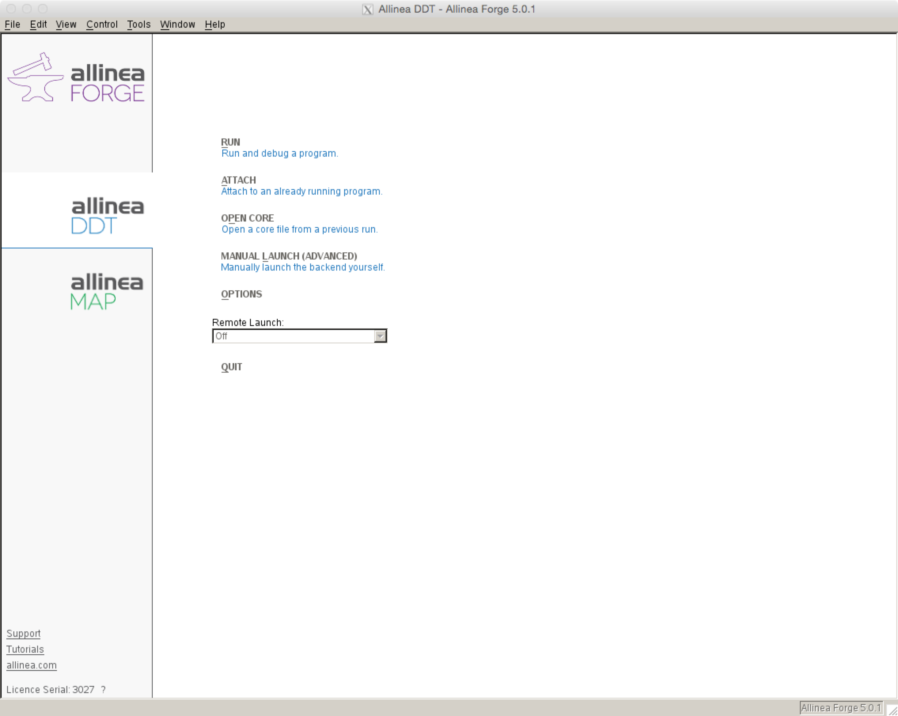

Then a submission window will appear with a prefilled path to the
executable to debug. Select the number of processors on which to run
and press run. To pass command line arguments to a program enter them
in the 'srun arguments' box.

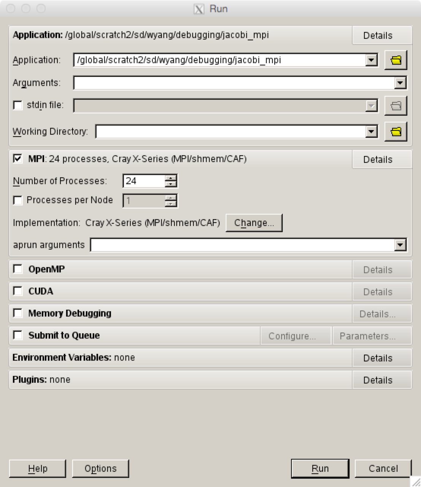

## Reverse Connect Using Remote Client

Arm provides remote clients for Windows, macOS and Linux that can
run on your local desktop to connect via SSH to NERSC systems to
debug, profile, edit and compile files directly on the remote NERSC
machine. You can download the clients from [Arm Forge download
page](https://developer.arm.com/products/software-development-tools/hpc/downloads/download-arm-forge)
and install on your laptop/desktop. Please note that the client
version must be the same as the Arm Forge version that you're going
to use on the NERSC machines.

First, we need to configure the client for running a debugging session
on a NERSC machine. Start the client, and select 'Configure...' in the
'Remote Launch' pull-down menu.

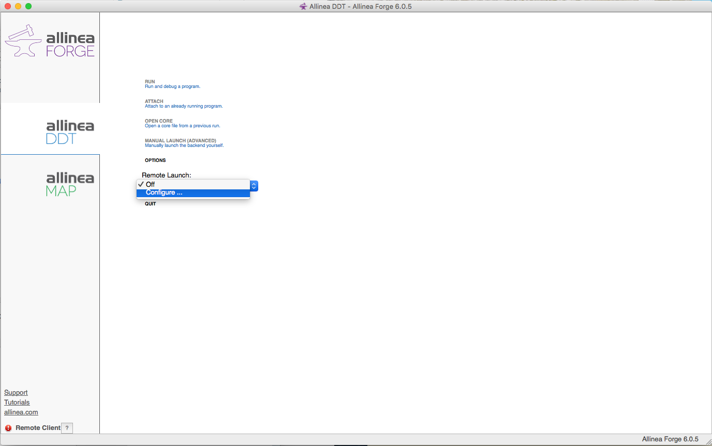

That will open the 'Configure Remote Connections' window.

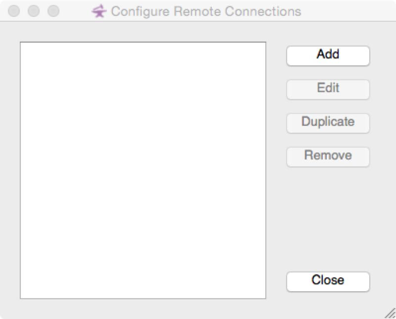

Using the 'Add', 'Edit' and other buttons, create configuration for
Cori, as shown in the following example.

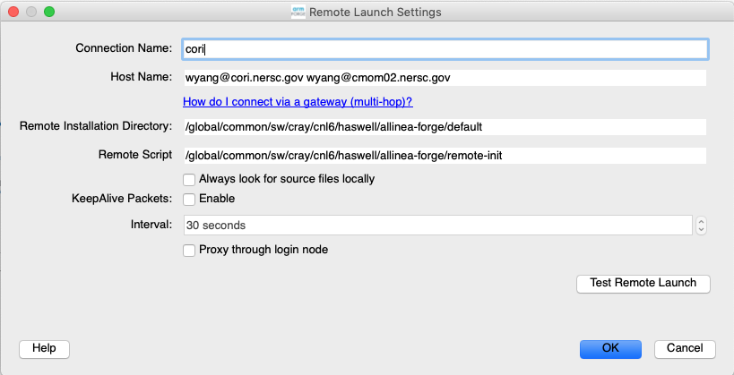

Make sure that you uncheck the 'Proxy through login node' box.

The configuration settings for Edison should be as follows:

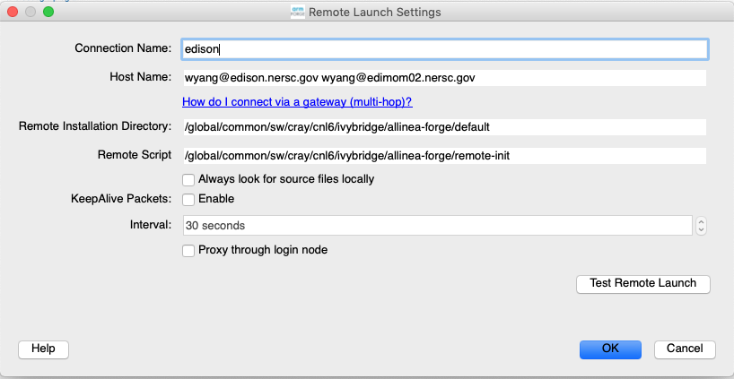

For versions prior to 18.3:

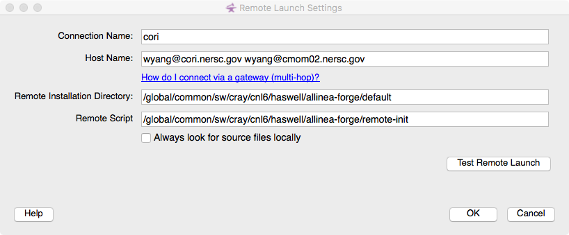

and

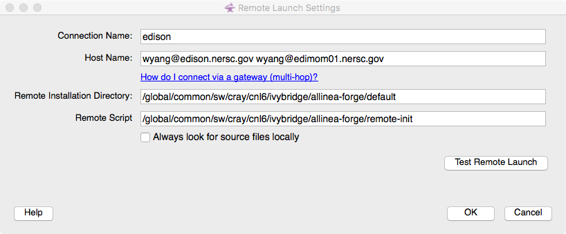

!!! note
	In the Host Name field, we need enter two account entries for the Cray
	machines, one with the machine name itself and the other with one of
	its MOM nodes (`wyang@cmom02.nersc.gov` in the above example).

Edison has 6 MOM nodes: edimom01, edison02, ..., and edimom06.

Cori's MOM node names are cmom02 and cmom05.

For the 'Remote Installation Directory', use the path for the default
`allinea-forge` module. The value for the 'Remote Script' field
should be exactly the same as shown above.

The Remote Installation Directory and Remote Script values for Cori
for the `allinea-forge` module are
`/global/common/sw/cray/cnl6/haswell/allinea-forge/default` and
`/global/common/sw/cray/cnl6/haswell/allinea-forge/remote-init`,
respectively.

For Edison the correct paths are
`/global/common/sw/cray/cnl6/ivybridge/allinea-forge/default` and
`/global/common/sw/cray/cnl6/ivybridge/allinea-forge/remote-init`.

To start a debugging session on a machine, you need to login to the
corresponding machine. This chooses the configuration for the machine
from the same 'Remote Launch' menu.

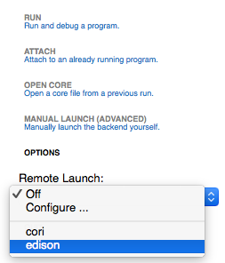

You'll be prompted to enter the password even when you have set up
passwordless connections by storing your ssh public key in NIM.

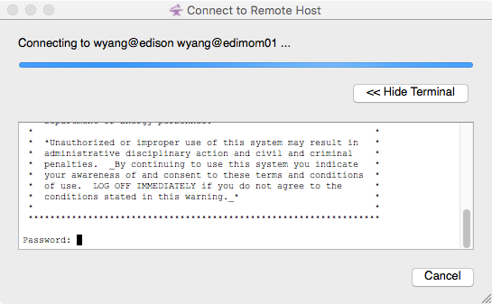

Arm recommends to use the __Reverse Connection__ method with the
remote client. To do this, put aside the remote client window that
you have been working with, and login to the corresponding machine
from a window on your local machine, as you would normally do. Then,
start an interactive batch session there, and run ddt with with the
option `--connect` as follows:

```Shell
nersc$ ssh edison.nersc.gov
[snip]
nersc$ salloc -N 1 -t 30:00 -p debug -C haswell
[snip]
nersc$ module load alline-forge
nersc$ ddt --connect srun -n 24 ./jacobi_mpi
```

The remote client will ask you whether to accept a Reverse Connect
request. Click 'Accept'.

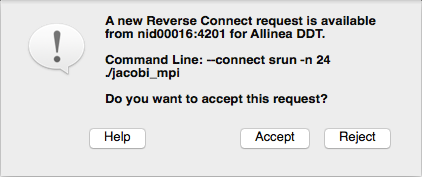

The usual Run window will appear where you can change or set run
configurations and debugging options. Click 'Run'.

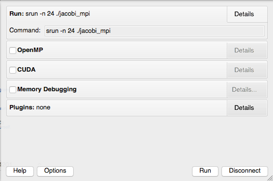

Now, you can start debugging in the remote client:

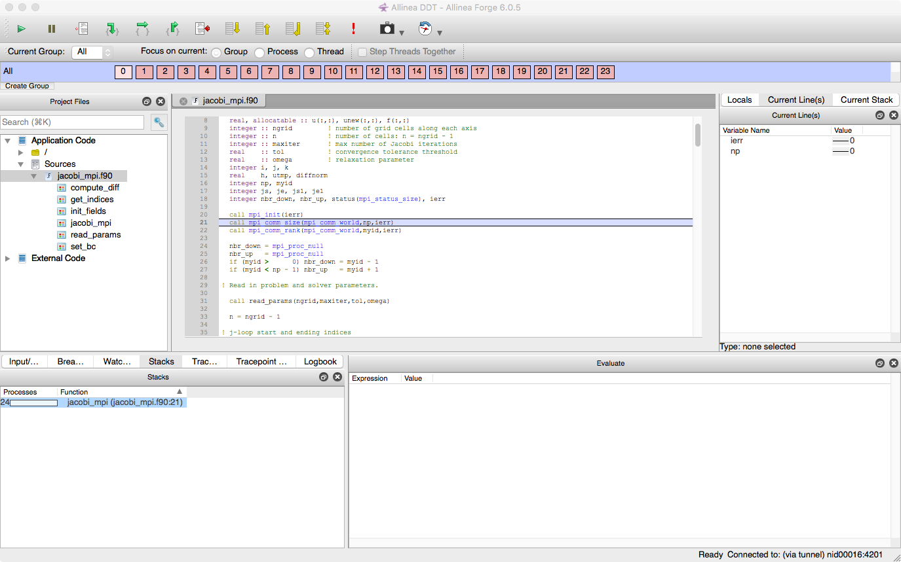

## Troubleshooting

If you are having trouble launching DDT try these steps.

Make sure you have the most recent version of the `system.config`
configuration file. The first time you run DDT, you pick up a master
template which then gets stored locally in your home directory in
`~/.allinea/${NERSC_HOST}/system.config` where `${NERSC_HOST}` is the
machine name: cori or edison. If you are having problems launching DDT
you could be using an older verion of the `system.config` file and you
may want to remove the entire directory:

```Shell
nersc$ rm -rf ~/.allinea/${NERSC_HOST}
```

Remove any stale processes that may have been left by DDT.

```Shell
nersc$ rm -rf $TMPDIR/allinea-$USER
```

In case of a font problem where every character is displayed as a
square, please delete the `.fontconfig` directory in your home
directory and restart ddt.

```Shell
nersc$ rm -rf ~/.fontconfig
```

Make sure you are requesting an interactive batch session on Cori
or Edison.  NERSC has configured DDT to run from the interactive
batch jobs.

```Shell
nersc$ salloc -q debug -N numNodes
```

Finally make sure you have compiled your code with `-g`. A large number
of users who are having trouble running with parallel debuggers forget
to compile their codes with debugging flags turned on.

## Basic Debugging Functionality

The DDT GUI interface should be intuitive to anyone who has used a
parallel debugger like Totalview before. Users can set breakpoints,
step through code, set watches, examine and change variables, dive
into arrays, dereference pointers, view variables across processors,
step through processors etc. Please see the [Arm Forge User
Guide](https://developer.arm.com/docs/101136/latest/arm-forge) if
you have trouble with any of these basic features.

## Useful DDT Features

### Process Groups

With DDT, the user can easily change the debugger to focus on a single
process or group of processes. If Focus on current Processor is
chosen, then stepping through the code, setting a breakpoint etc will
occur only for a given processor. If Focus on current Group is chosen
then the entire group of processors will advance when stepping forward
in a program and a breakpoint will be set for all processors in a
group.


Similary, when Focus on current Thread is chosen, then all actions are
for an OpenMP thread. DDT doesn't allow to create a thread
group. However, one can click the Step Threads Together box to make
all threads to move together inside a parallel region. In the image
shown above, this box is grayed out simply because the code is not an
OpenMP code.

A user can create new sub-groups of processors in several ways. One
way is to click on the 'Create Group' button at the bottom of the
'Process Group Window'. Another way is to right-click in the 'Process
Group Window' to create a group and then drag the desired processors to
the group. Groups can also be created more efficiently using
sub-groups from the 'Parallel Stack View' described below. The below
image shows 3 different groups of processors, the default All group, a
group with only a single master processor 'Master' and a group with the
remaining 'Workers' processors.


### Parallel Stack View

A feature which should help users debug at high concurrencies is DDT's
'Parallel Stack View' window found in the lower left area, which allows
the user to see the position of all processors in a code at the same
time from the main window. A program is displayed as a branching tree
with the number and location of each processor at each point. Instead
of clicking through windows to determine where each processor has
stopped, the 'Parallel Stack View' presents a quick overview which
easily allows users to identify stray processes. Users can also create
sub-groups of processors from a branch of the tree by right clicking
on the branch. A new group will appear in the 'Process Group Window' at
the top of the GUI.

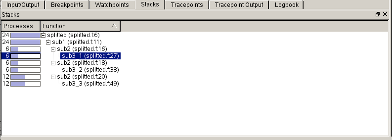

## Memory Debugging

DDT has a memory debugging tool that can show heap memory usage across
processors.

### Static linking

To access the memory debugging feature, you must first build your code
for memory debugging. On Cori and Edison, you have to follow certain
steps. Below is a table showing steps for building a static executable
using different compilers for memory debugging on Edison and Cori. The
linking step is made of two parts. The first is to run in verbose mode
using the `-v` flag to show all the linking steps taken. The second step
is to rerun the last linker line after inserting some more options.

*   GNU
	```Shell
	nersc$ ftn -g -c prog.f
	nersc$ ftn -v -o prog prog.o          # -v to get the last linker line
	```
	Rerun the last linker line after inserting `-zmuldefs` right after the command and putting `${DDT_LINK_DMALLOC}` just before `-lc:`
   	```Shell
	nersc$ /opt/gcc/4.7.1/snos/libexec/gcc/x86_64-suse-linux/4.7.1/collect2 -zmuldefs ... ${DDT_LINK_DMALLOC} -lc ...
	```
*   Cray
	```Shell
	nersc$ ftn -g -c prog.f
	nersc$ ftn -v -o prog prog.o
	```
    Do similarly as with GNU:

	```Shell
	nersc$ /opt/cray/cce/8.0.7/cray-binutils/x86_64-unknown-linux-gnu/bin/ld -zmuldefs ... ${DDT_LINK_DMALLOC} -lc ...
	```

*   Intel
	```Shell
	nersc$ ftn -g -c prog.f
	nersc$ ftn -v -o prog prog.o
	```

    There are two locations to put `${DDT_LINK_DMALLOC}` as there are two `-lc`'s:

	```Shell
	nersc$ ld -zmuldefs ... ${DDT_LINK_DMALLOC} -lc ... ${DDT_LINK_DMALLOC} -lc ...
	```

!!! notes
	The example commands are shown for a Fortran case. `cc` and `CC` should be
	used for C and C++ codes. In case of a C++ code,
	`${DDT_LINK_DMALLOCXX}` is to be used instead of
	`${DDT_LINK_DMALLOC}`.

A simple script, `static_linking_ddt_md`, is provided in your `$PATH` to
help you complete the somewhat complicated steps shown above.

```Shell
nersc$ module load allinea-forge
nersc$ ftn -g -c prog.f
nersc$ static_linking_ddt_md ftn -o prog prog.o          # instead of 'ftn -o prog prog.o'
nersc$ ls -l prog
-rwx------ 1 wyang wyang 6701908 2012-10-15 15:19 prog
```

You need to separate the compile and link stages. That is, you need to
create `*.o` files using the `-c` compile flag first; otherwise, you
can see the following message:

```Shell
/usr/bin/ld: cannot find /scratch/scratchdirs/wyang/ifortnr7R21.o: No such file or directory
```

For multi-threaded codes, DDT_LINK_DMALLOCTH and DDT_LINK_DMALLOCTHCXX
are used in place of DDT_LINK_DMALLOC and DDT_LINK_DMALLOCXX,
respectively. Again, a utility script, `static_linking_ddt_md_th`, is
provided to help with linking:

```Shell
nersc$ static_linking_ddt_md_th ftn -mp -o prog prog.o   # instead of 'ftn -mp -o prog prog.o'
```

### Dynamic linking

The example is provided for a Fortran code case. Adjustments should be
made for C and C++ codes as above. Again, in case of a C++ code,
`${DDT_LINK_DMALLOC}` must be repalced with `${DDT_LINK_DMALLOCXX}`.

 *  Cray
	```Shell
	nersc$ ftn -g -c prog.f
	nersc$ ftn -dyanmic -o prog prog.o ${DDT_LINK_DMALLOC} --Wl,--allow-multiple-definition
	```

 *  GNU/Intel
	```Shell
	nersc$ ftn -g -c prog.f
	nersc$ ftn -dynamic -o prog.o ${DDT_LINK_DMALLOC} -zmuldefs
	```

For multi-threaded codes, `${DDT_LINK_DMALLOCTH}` or
`${DDT_LINK_DMALLOCTHCXX}` should be used instead.

Next, when DDT starts, you must click the 'Memory Debugging' checkbox
in the DDT run menu that first comes up.

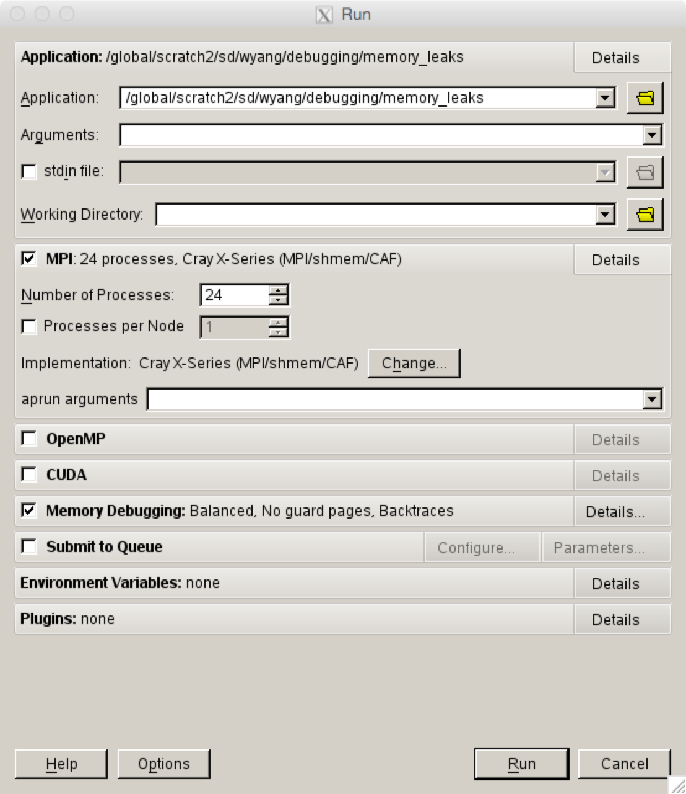

To set detailed memory debugging options, click the 'Details...'
button on the far right side, which will open the 'Memory Debugging
Options' window. There you can set the heap debugging level, the
number of guard pages before or after arrays (but not both) for
detection of heap overflow or underflow in the program, etc. The
default page size is 4 KB.

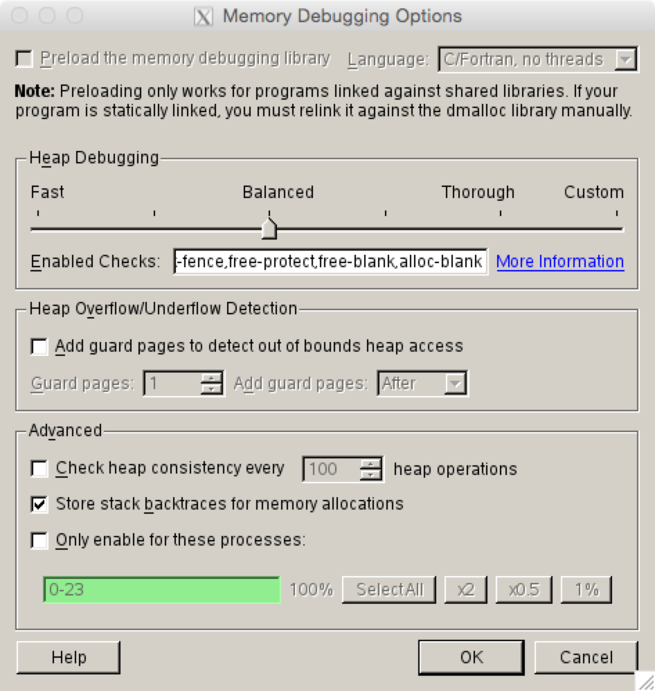

When running ddt with a statically built code, please deselect the
'Preload the memory debugging library' item. Otherwise, ddt can hang
indefinitely during startup on Cray machines.

Also, leave the 'Preload ...' checkbox with a dynamically linked
executable unchecked on the Cray machines if a C++ version of
Arm Forge's dmalloc library was used (that is, when
`$DDT_LINK_DMALLOCXX` or `$DDT_LINK_DMALLOCTHCXX` was
used). Otherwise, ddt hangs during startup.

### Usage

Several features are enabled with memory debugging. Select 'Current
Memory Usage' or 'Memory Statistics' under the 'Tools' menu. With
the following buggy code that generates memory leaks:

```Fortran
      program memory_leaks

!...  Buggy code prepared by NERSC User Service Group for a debugging tutorial
!...  February, 2012

      implicit none
      include 'mpif.h'
      integer, parameter :: n = 1000000
      real val
      integer i, ierr
      call mpi_init(ierr)
      val = 0.
      do i=1,10
         call sub_ok(val,n)
      end do
      do i=1,10
         call sub_bad(val,n)
      end do
      do i=1,10
         call sub_badx2(val,n)
      end do
      print *, val
      call mpi_finalize(ierr)
      end

      subroutine sub_ok(val,n)      ! no memory leak
      integer n
      real val
      real, allocatable :: a(:)
      allocate (a(n))
      call random_number(a)
      val = val + sum(a)
!     deallocate(a)                 ! ok not to deallocate
      end

      subroutine sub_bad(val,n)     ! memory leak of 4*n bytes per call
      integer n
      real val
      real, pointer :: a(:)
      allocate (a(n))
      call random_number(a)
      val = val + sum(a)
!     deallocate(a)                 ! not ok not to deallocate
      end

      subroutine sub_badx2(val,n)   ! memory leak of 8*n bytes per call
      integer n
      real val
      real, pointer :: a(:)
      allocate (a(n))
      call random_number(a)
      val = val + sum(a)
      allocate (a(n))               ! not ok to allocate again
      call random_number(a)
      val = val + sum(a)
!     deallocate(a)                 ! not ok not to deallocate
      end
```

You can easily see heap memory information (such as how much is being
used, how much has been allocated, how much is freed, etc.), from
which you can deduce where memory leaks occur. Below is a window shown
when the 'Current Memory Usage' menu is selected:

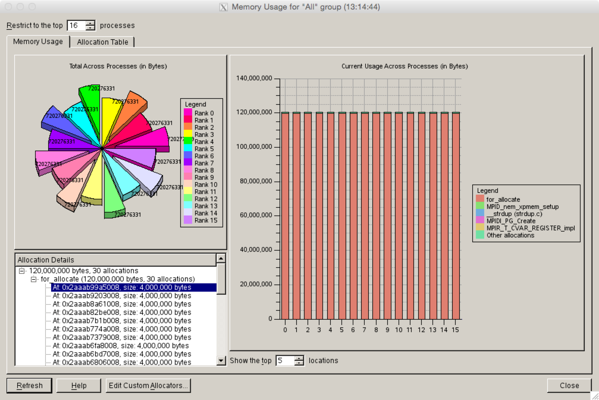

It displays current heap memory usage of the program and the routines
where it is allocated. Clicking on a histogram bar on the right, you
will see the 'Allocation Details' box on the left filled up with
information about where the memory allocation was made. By clicking on
one of the pointers in the 'Allocation Details' list you can get
information mapped to source code:

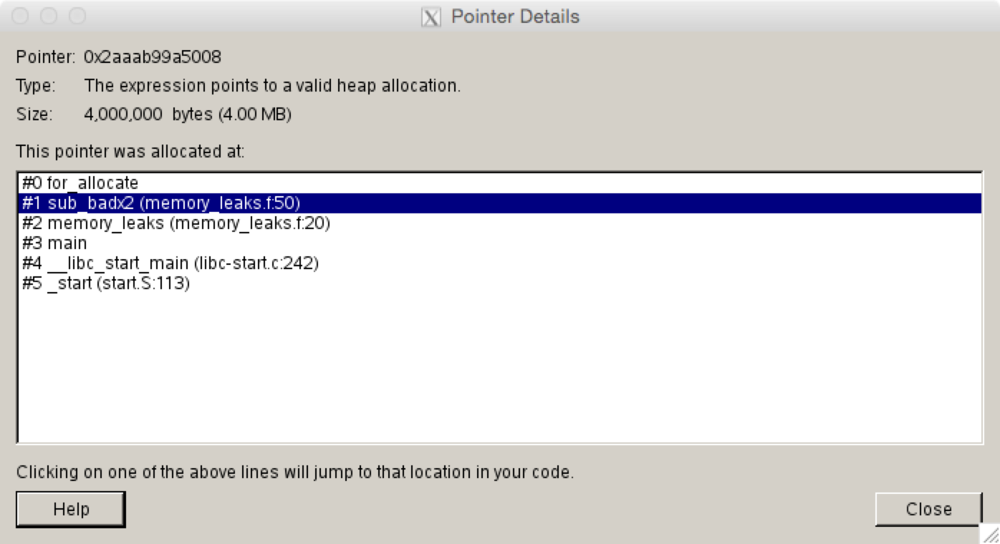

It shows how much It is known that memory debugging can fail with the
error message 'A tree node closed prematurely. One or more proceses
may be unusable.', especially with MPI_Bcast. A workaround is to
disable 'store stack backtraces for memory allocations' option in the
'Enable Memory Debugging' setting. This problem will be fixed in the
next release.

## Offline Debugging

Offline debugging is to run DDT in a command-line mode, without using
GUI. This mode may be useful if all you want is to get tracepoint (a
specified location in the code where requested values are printed)
output or stack backtraces without directly interacting with DDT. This
can be good for a "parameter study" where you want to check for an
error condition for a range of a parameter value, which would become a
tedious task if GUI is used.

To run DDT in this mode, you submit a batch job using a batch script
that looks like:

```Shell
nersc$ cat runit
#!/bin/bash
#SBATCH ...

module load allinea-forge
ddt --offline -o filename.html --np=4 myprogram arg1 ... # to get HTML output file
ddt --offline -o filename      --np=4 myprogram arg1 ... # to get plain text output file

nersc$ sbatch runit
```

Please note that we are using `ddt -offline ...` in place of `srun` or
`mpirun` for launching an application. Output of the debugging session
is saved in the specified file (`filename.html` or `filename` in
the above example).

Some options can be used for the ddt command:

-   **`--session=sessionfile`**: run using settings saved using the 'Save
    Session' option during a previous GUI run session

-   **`--np=numTasks`**: run with `numTasks` (MPI) tasks

-   **`--mem-debug`**: enable memory debugging

-   **`--trace-at=LOCATION[,N:M,P],VAR1,VAR2,... [if CONDITION]`**: set a
    tracepoint at location `LOCATION` (given by either
    '`filename:linenumber`' or `functionname` as in `main.c:22` or
    `myfunction`), beginning recording after the N-th visit of each
    process to the location, and recording every M-th subsequent pass
    until it has been triggered P times; record the value of variable
    `VAR1`, `VAR2`, ...; the if clause allows to specify a boolean
    `CONDITION` that must be satisfied to trigger the tracepoint

-   **`--break-at=LOCATION[,N:M:P] [if CONDITION]`**: set a breakpoint at a
    location using the format explained above; the stack back traces of
    pausing processes will be recorded at the breakpoint before they are
    then made to continue

An example using the following simple code is shown below:

```Fortran
      program offline
!...  Prepared for a debugger tutorial by NERSC
      include 'mpif.h'
      integer, parameter :: n = 24
      real, allocatable :: a(:)
      integer i, me
      call mpi_init(ierr)
      call mpi_comm_rank(mpi_comm_world,me,ierr)
      allocate (a(n))
      call random_number(a)
      do i=1,n
      if (mod(i,2) == 1) call sub(i,n,a)      ! 'sub' called when i=1,3,5,...
      end do
      print *, me, sum(a)
      deallocate(a)
      call mpi_finalize(ierr)
      end

      subroutine sub(i,n,a)
      integer n, i, j
      real a(n)
      do j=1,n
      a(j) = cos(a(j))
      end do
      end
```

The following is to set a tracepoint at the beginning of the routine
`sub` where values of `i` and `a(1)` are to be printed; and to set a
breakpoint at line 23, using the activation scheme of '5:3:2':

```Shell
ddt --offline -o offline.html --np=4 --trace-at=sub,i,a\(1\) --break-at=offline.f:23,5:3:2 ./offline
```

The output file is broken into three sections: 'Messages' (showing
process activities such as startup and termination etc., as well as
call backtrace at breakpoints), 'Tracepoints' (showing output from
activated tracepoints), and 'Output' (program output).

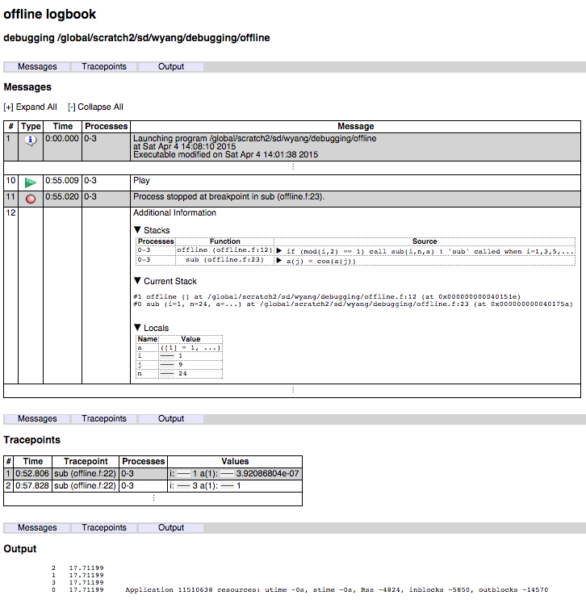

## Introductory Video Tutorial

A video tutorial for how to use DDT can be found
on [vimeo](https://vimeo.com/19978486).
