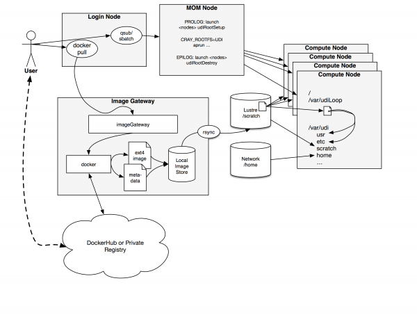
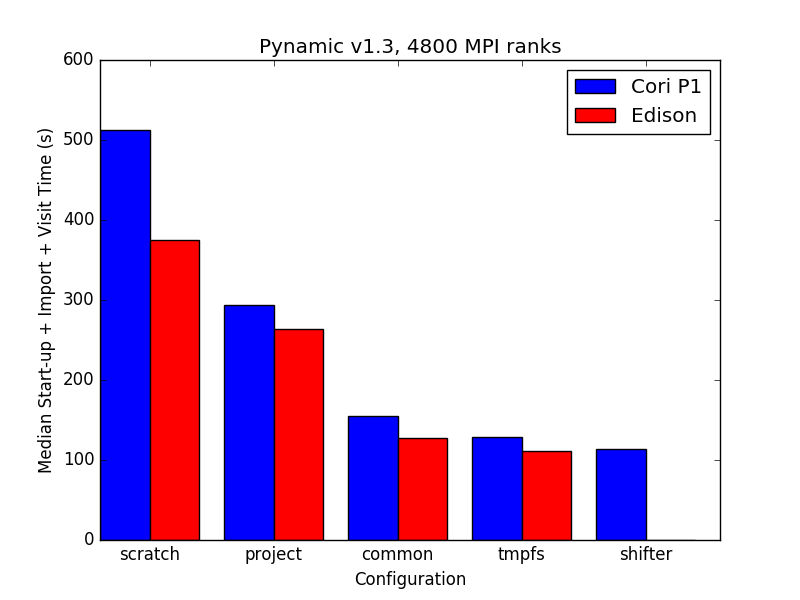

#Bringing Linux containers to HPC

For more information about using Shifter, please consult the [documentation](how-to-use.md).

##Background

Containers provide a powerful method to increase flexibility, reproducibility
and usability for running scientific applications.  NERSC has developed and supports Shifter to enable users to securely
run [Docker](https://www.docker.com) images on NERSC systems at scale.
A user can use Shifter to easily pull down an image from a registry like DockerHub and then run that image on systems
like Cori and Edison.  In addition, Shifter is designed to scale and has been
demonstrated to run efficiently at even the largest sizes on Cori.

Linux containers allow an application to be packaged with its entire software stack - including the base Linux OS, libraries, packages, etc - as well defining required environment variables and application "entry point".  Containers provide an abstract and portable way of deploying applications and even automating the execution without requiring detailed tuning or modification to run on different systems.

Shifter works by converting Docker images to a common format that can then be
efficiently distributed and launched on HPC systems. The user interface to shifter enables a user to select an image from their dockerhub account or the NERSC private registry and then submit jobs which run entirely within the container.

*Fig. 1: shifter Workflow*

As shown in <a href="#fig1">Fig. 1</a>, shifter works by enabling users to pull images from a DockerHub or private docker registry. An image manager at NERSC then automatically converts the image to a flattened format that can be directly mounted on the compute nodes. This image is copied to the Lustre scratch filesystem (in a system area).  The user can then submit jobs specifying which image to use. Private images are only accessible by the user that authenticated and pulled them, not by the larger community.  In the job the user has the ability to either run a custom batch script to perform any given command supported by the image, or if a Docker entry-point is defined, can simply execute the entry-point.

Shifter mounts the flattened image via a loop mount.  This approach has the advantage of moving metadata operations (like file lookup) to the compute node, rather than relying on the central metadata servers of the parallel filesystem. Based on benchmarking using the  pynamic benchmark, this approach greatly improves the performance of applications and languages like Python that rely heavily on loading shared libraries <a href="#fig2">Fig. 2</a>. These tests indicate that Shifter essentially matches the performance of a single docker instance running on a workstation despite the fact that shifter images are stored on a parallel filesystem.

*Fig. 2: pynamic benchmark run on various NERSC file systems. tmpfs is local RAM disk on the compute nodes. Shorter is better*

Please refer to the [Cray User Group 2015 paper](files/cug2015udi.pdf), as well as our [presentation slides](files/nersc-brownbag-docker-jacobsen-canon.pdf) for more information about Docker in HPC and shifter implementation details.
